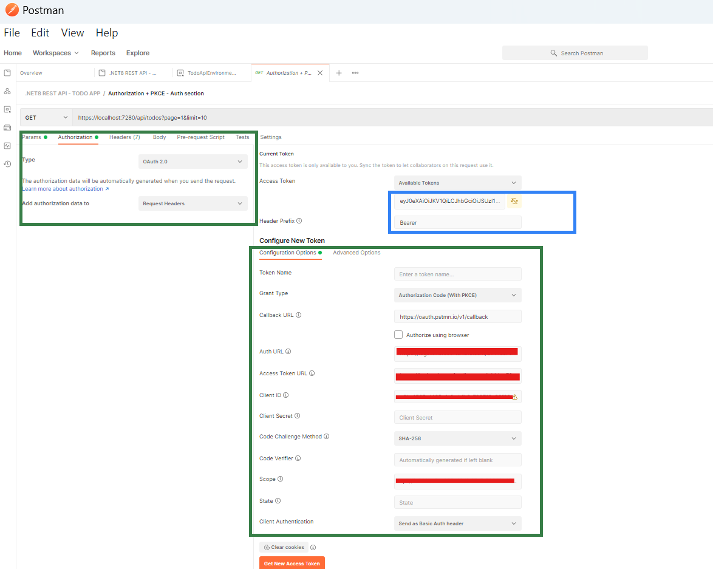
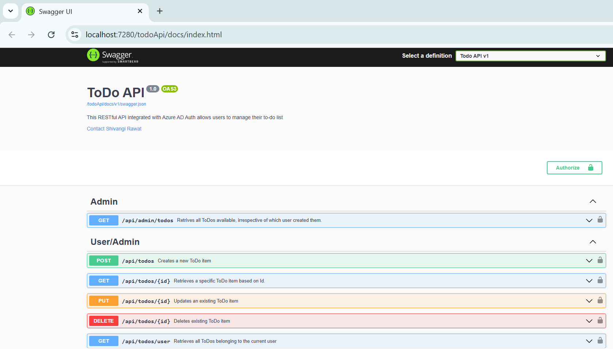

# ✅ Todo REST API (.NET 8 + Azure AD + Clean Architecture)

This **Todo REST API** allows users to manage their to-do list. It's built with **C#**, **.NET 8**, and integrated with **Azure AD** for secure user authentication via **OAuth 2.0** (Authorization Code Flow with PKCE). 

---

## Tech Stack

<p>
  
  
  
  
  
  
  
  
  
</p>

## 🚀 Key Features

- 🧱 **Clean Architecture**
- 🔐 **Azure AD Authentication + PKCE**
- 📘 **OpenAPI (Swagger) docs** with XML comments
- 📄 **Paginated API responses**
- 🧬 **Entity Framework (Code-First approach)**
- 🧑‍⚖️ **Role-Based Access Control** (User / Admin)
- 🧪 **Unit Testing** with xUnit & Moq
- 🛡 **API Rate Limiting** using built-in ASP.NET 8 middleware


## 🎯 Why This Project Was Built

This project was developed to gain **hands-on experience in .NET 8 REST API**.  
The aim was to go beyond basic CRUD implementation and target **real-world, enterprise-grade** solutions with a focus on:

1️⃣ **Azure AD Authentication** (OAuth 2.0 Authorization Code Flow)  
2️⃣ **OpenAPI** for defining API contracts and **Swagger UI** for rendering interactive documentation

> 💡 **Inspiration**: This project is based on [roadmap.sh](https://roadmap.sh/projects/todo-list-api), which provides **role-based roadmaps**, learning resources, and real-world projects to help developers upskill.

This idea has been further extended by simulating how an **enterprise-grade API** might be designed, secured, and documented.


## 🧱 Project Architecture

The project uses **Clean Architecture** to ensure:

- Clear separation of concerns
- Maintainability and testability
- Scalability for future enhancements

## 🔐 Authentication & Authorization

This API uses **OAuth 2.0 Authorization Code Flow with PKCE**, designed for secure frontend (SPA) consumption.

### ❓ Why PKCE?

- This API simulates being called from a **Single Page Application (SPA)** or **Postman**, both of which **cannot securely store secrets**.
- PKCE enhances security for public clients.
- Confidential clients (like server-side apps) can use the flow **without PKCE**.


## 🧭 Azure AD Setup Instructions (Microsoft Entra ID)

### 1️⃣ Register Backend API

1. Go to **Microsoft Entra ID → App Registrations**
2. Create an app: `todo-api-backend`
3. Under **Expose an API**:
   - Click **Add Scope**
   - Create a scope like `access-as-app-user`
   - Format: `api://{Application ID}/access-as-app-user`
4. Under **App Roles**:
   - Create roles: `admin`, `user`
   - Enable them

### 2️⃣ Register Frontend App

1. Go to **App Registrations**
2. Create app: `postman-as-frontend`
3. Under **API Permissions**:
   - Click **Add a permission**
   - Add delegated access to `todo-api-backend` using its Application(client) ID
4. Under **Authentication**:
  - Click **Add a platform**
  - Select SPA (This is needed to work with Swagger)
  - Add Swagger redirect url 'https://localhost:7280/todoApi/docs/oauth2-redirect.html'
  - Add Postman redirect url 'https://oauth.pstmn.io/v1/callback'

### 3️⃣ Create Users and Assign Roles

1. In **Enterprise Applications** > `todo-api-backend`
2. Assign app roles (`admin`, `user`) to users

## ⚙️ Getting Started

### 1️⃣ Clone the Repository
### 2️⃣ Prepare the Environment
#### - Restore NuGet packages 
 ```bash
dotnet restore
```
#### - Build Solution 
```bash
dotnet build
```
#### - Apply EF Core migrations to create the database
```bash
dotnet ef database update
```
Once the project is configured, there are 2 ways to interact with API :

#### 🚀 **Option 1: Using Swagger UI**

✅ **Configuration**

1. Edit **appsettings.json**
Replace placeholder values in the "AzureAd" section:
```bash
"AzureAd": {
  "TenantId": "{your-tenant-id}",
  "ClientId": "{your-frontend-app-id}",
  "Audience": "{your-backend-app-id}",
  "Domain": "{your-azure-domain}"
```

2. Edit **SwaggerServiceExtensions.cs**
Replace hardcoded values used for OAuth2 flow in Swagger UI setup:
```bash
AuthorizationUrl = new Uri("https://login.microsoftonline.com/{your-tenant-id}/oauth2/v2.0/authorize"),
TokenUrl = new Uri("https://login.microsoftonline.com/{your-tenant-id}/oauth2/v2.0/token"),
Scopes = new Dictionary<string, string>
{
    { "api://{your-backend-app-id}/access-as-user", "Access Todo API" }
}

action.OAuthClientId("<your-frontend-app-id>");
```
✅ This enables the Authorize button in Swagger UI for OAuth2.

> [!IMPORTANT]
Updating above files with your Azure values is required to run the project with **Swagger**

▶️ **Run**
1. Run the API: `dotnet run`
2. Open https://localhost:7280/todoApi/docs/index.html
3. Click Authorize, login via Azure AD

Use **Try it out** to call endpoints.

#### 📬 **Option 2: Using Postman**

##### ✅ **Configuration**

- Update `appsetting.json`(similar to above Swagger option)
- No need to modify ` SwaggerServiceExtensions.cs`
- Import the Postman collection from ``/postman/TodoApi.postman_collection.json``

> Postman is used here to simulate a **public client** using the API with OAuth2 + PKCE.

##### 🔑 Authorization Setup:
Once the import is successful, use the Postman's Authorization tab to update below placeholders with actual values. 
-> `{your-tenantId}` : Your Azure AD(Entra ID) Tenant ID
-> `{your-frontend-app-id}` : Application(client) ID of your Front-end app or Postman App on Azure. 
-> `{your-backend-app-id}` :  Application(client) ID of your Backend Todo API on Azure.

Below is how your Postman's Authorization tab(🟩green-highlighted) will look like, once all the values are filled in as per above instructions. 

###### Screenshot Example



#### ▶️ Running Postman:
1. Click **"Get New Access Token"**
   
This will open a browser window for Azure AD login and fetch an access token.

3. After successful login, click **"Use Token"**
   
The token will be injected into Postman's current Token field (🔵 blue-highlighted in above image).

Ensure the **Header Prefix** is set to Bearer

✅ Now, you are all set to make API calls. 


## 📘 Swagger & OpenAPI

The project uses **Swashbuckle** to auto-generate Swagger UI from OpenAPI specs and XML comments.

- ✅ Custom OpenAPI metadata (title, version, contact info)
- ✅ XML comments from controllers
- ✅ Security Definition (OAuth2 + PKCE)
- ✅ Schema customization using SchemaFilter

🔗Swagger UI Url : https://localhost:7280/todoApi/docs/index.html



> [!IMPORTANT]
> The port (`7280`) may vary depending on your local setup. Update the API & Swagger URL if your project runs on a different port.

## 🤝 Contributing
This is a personal project but any suggestions or recommendations are welcome.

## 📄 License
This project is licensed under the [MIT License](./LICENSE).

