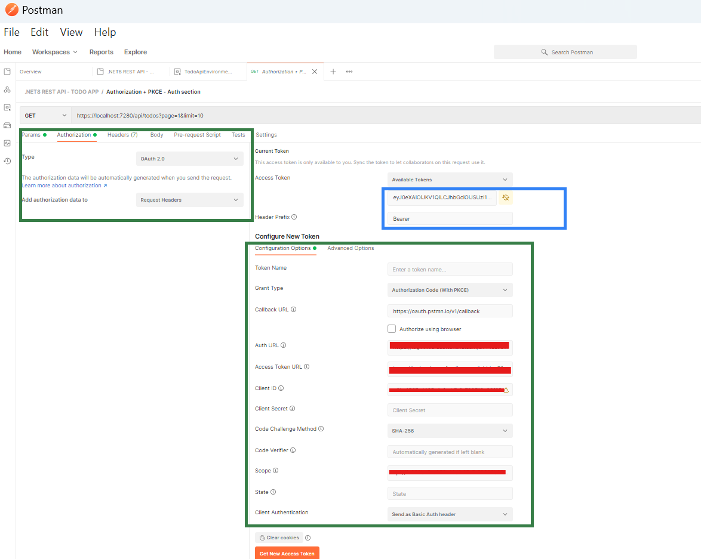

# ✅ Todo REST API (.NET 8 + Azure AD + Clean Architecture)

This **Todo REST API** allows users to manage their to-do list. It's built with **C#**, **.NET 8**, and integrated with **Azure AD** for secure user authentication via **OAuth 2.0 (Authorization Code Flow with PKCE)**.

---

## 🚀 Features

- 🧱 **Clean Architecture**
- 🔐 **Azure AD Authentication + PKCE**
- 📘 **OpenAPI (Swagger) docs** with XML comments
- 📄 **Paginated API responses**
- 🧬 **Entity Framework (Code-First approach)**
- 🧑‍⚖️ **Role-Based Access Control** (User / Admin)
- 🧪 **Unit Testing** with xUnit & Moq
- 🛡 **API Rate Limiting** using built-in ASP.NET 8 middleware

---

## 🎯 Why This Project Was Built

This project was developed to gain **hands-on experience in .NET 8 REST API**.  
The aim was to go beyond basic CRUD implementation and target **real-world, enterprise-grade** solutions with a focus on:

1️⃣ **Azure AD Authentication** (OAuth 2.0 Authorization Code Flow)  
2️⃣ **OpenAPI** for defining API contracts and **Swagger UI** for rendering interactive documentation

> 💡 **Inspiration**: This project is based on [roadmap.sh](https://roadmap.sh/projects/todo-list-api), which provides **role-based roadmaps**, learning resources, and real-world projects to help developers upskill.

This idea has been further extended by simulating how an **enterprise-grade API** might be designed, secured, and documented.

---
## 🧱 Project Architecture

The project uses **Clean Architecture** to ensure:

- Clear separation of concerns
- Maintainability and testability
- Scalability for future enhancements

## 🔐 Authentication & Authorization

This API uses **OAuth 2.0 Authorization Code Flow with PKCE**, designed for secure frontend (SPA) consumption.

### ❓ Why PKCE?

- This API simulates being called from a **Single Page Application (SPA)** or **Postman**, both of which **cannot securely store secrets**.
- PKCE enhances security for public clients.
- Confidential clients (like server-side apps) can use the flow **without PKCE**.

---

## 🧭 Azure AD Setup Instructions (Microsoft Entra ID)

### 1️⃣ Register Backend API

1. Go to **Microsoft Entra ID → App Registrations**
2. Create an app: `todo-api-backend`
3. Under **Expose an API**:
   - Click **Add Scope**
   - Create a scope like `access-as-app-user`
   - Format: `api://{Application ID}/access-as-app-user`
4. Under **App Roles**:
   - Create roles: `admin`, `user`
   - Enable them

### 2️⃣ Register Frontend App

1. Go to **App Registrations**
2. Create app: `postman-as-frontend`
3. Under **API Permissions**:
   - Click **Add a permission**
   - Add delegated access to `todo-api-backend` using its Application ID

### 3️⃣ Create Users and Assign Roles

1. In **Enterprise Applications** > `todo-api-backend`
2. Assign app roles (`admin`, `user`) to users

---

## 📬 Postman Setup

To test the API quickly using Postman:

1. Import the Postman collection:

```bash
/postman/TodoApi.postman_collection.json
```
> Postman is used here to simulate a **public client** using the API with OAuth2 + PKCE.

🛑 **Important:** Replace below placeholders in the 'TodoApi.postman_collection' file with your actual Azure AD details.

-> `{your-tenantId}` : Your Azure AD(Entra ID) Tenant ID

-> `{your-frontend-app-id}` : Application(client) ID of your Front-end app or Postman App on Azure. 

-> `{your-backend-app-id}` :  Application(client) ID of your Backend Todo API on Azure.

Below is how your Postman's Authorization tab(🟩green-highlighted) will look like, once all the values are filled in as per above instructions. 

### Screenshot Example



1. Click **"Get New Access Token"**
This will open a browser window for Azure AD login and fetch an access token.

2. After successful login, click **"Use Token"**
The token will be injected into Postman's Current Token field (🔵 blue-highlighted).

Ensure the **Header Prefix** is set to Bearer

✅ Now, you are all set to make API calls.  

---
## 📘 Swagger & OpenAPI

The project uses **Swashbuckle** to auto-generate Swagger UI from OpenAPI specs and XML comments.

- ✅ Custom OpenAPI metadata (title, version, contact info)
- ✅ XML comments from controllers and DTOs
- ✅ OAuth2 with PKCE Swagger integration
- ✅ Paginated DTO schema filter using `ISchemaFilter`


